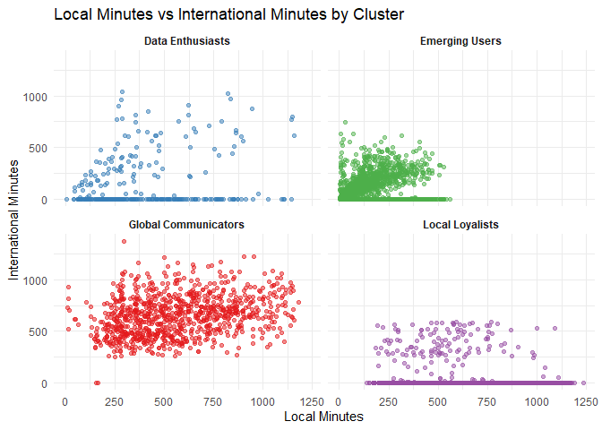

# SkyLink Communications Customer Cluster Analysis

>**[Back to Projects](../index.md)**

## Table of Contents
- [Overview](#overview)
- [Key Findings Summary](#key-findings-summary)
- [Key Steps and Insights](#key-steps-and-insights)
  - [Data Preparation and Exploration](#data-preparation-and-exploration)
  - [Data Normalization](#data-normalization)
  - [Determining the Optimal Number of Clusters](#determining-the-optimal-number-of-clusters)
  - [K-Means Clustering](#k-means-clustering)
- [Visualizations](#visualizations)
  - [Distribution of Account Length by Cluster](#distribution-of-account-length-by-cluster)
  - [Local vs. International Minutes by Cluster](#local-vs-international-minutes-by-cluster)
- [Conclusion](#conclusion)
  - [Summary of Insights](#summary-of-insights)
  - [Reflection on the Process](#reflection-on-the-process)
    
## Overview

For subscription-based businesses like telecom companies, reducing customer churn is a top priority. In this project, I used cluster analysis to segment the diverse customer base of SkyLink Communications, a fictional telecommunications company, into distinct groups. This segmentation helps me understand customer behaviors and preferences better, enabling me to tailor marketing strategies more effectively. The analysis focused on key customer attributes such as tenure, service usage, and charges to investigate churn rates.

## Key Findings Summary

| Cluster                 | Characteristics                                                                                          | Marketing Strategies                                                                                   |
|-------------------------|----------------------------------------------------------------------------------------------------------|--------------------------------------------------------------------------------------------------------|
| **Global Communicators** | - Long-term customers   - High international call usage   - High international charges                | - Loyalty programs   - Premium international calling plans                                          |
| **Data Enthusiasts**     | - High data usage   - Moderate international call usage                                                 | - Unlimited or high-data plans   - Bundled data and international calling features   - Promotions focusing on data services |
| **Emerging Users**       | - Newer customers   - Minimal service usage                                                           | - Engagement strategies to increase service utilization   - Introductory offers   - Educational marketing on services       |
| **Local Loyalists**      | - Long-term customers   - High local call usage   - Low international call usage                     | - Bundled services emphasizing local features   - Incentives for increased local usage   - Tailored local communication packages or discounts  |

## Key Steps and Insights

### Data Preparation and Exploration

I began by preparing and exploring the data, focusing on key continuous variables that influence customer behavior:

- **Customer Tenure**: Understanding how long customers stay with us helps identify loyalty patterns.
- **Service Usage**: Analyzing local, international calls, and data usage provides insights into customer needs and preferences.
- **Charges**: Examining charges for services helps in identifying customers' willingness to pay and their service tiers.

### Data Normalization

To ensure a fair comparison, I normalized the data, making sure each variable equally contributed to the clustering process.

### Determining the Optimal Number of Clusters

Using the Elbow Method, I determined that four clusters were optimal for the data. This method helped me identify the point where adding more clusters didn’t significantly improve the model.

### K-Means Clustering

I performed k-means clustering and identified four distinct customer segments:

1. **Global Communicators**
2. **Data Enthusiasts**
3. **Emerging Users**
4. **Local Loyalists**

## Visualizations

### Distribution of Account Length by Cluster

I visualized the distribution of customer tenure across clusters. The red dashed line indicates the overall mean account length of approximately 32 months.

### Local vs. International Minutes by Cluster

The scatter plot below shows the relationship between local and international minutes for each cluster.

- **Global Communicators**: Strong inclination towards international communication.
- **Local Loyalists**: Predominantly engage in local communication.

## Conclusion

### Summary of Insights

Recapping the main discoveries:

- **Global Communicators** are long-term customers with high international call usage and charges, suggesting they need loyalty programs and premium international calling plans.
- **Data Enthusiasts** have high data usage and moderate international call usage, indicating they would benefit from unlimited or high-data plans and bundled data services.
- **Emerging Users** are newer customers with minimal service usage, presenting an opportunity for engagement strategies, introductory offers, and educational marketing.
- **Local Loyalists** are long-term customers with high local call usage and low international call usage, indicating a preference for bundled local services and incentives for increased local usage.

### Reflection on the Process

Through this project, I learned:

- The importance of data normalization in ensuring fair comparison across variables.
- The utility of the Elbow Method in determining the optimal number of clusters.
- How clustering can reveal distinct customer segments, each with unique characteristics and needs, allowing for targeted marketing strategies.
- The insights gained from visualizing data, which can highlight patterns and trends that may not be immediately apparent from raw data alone.

See [this file](https://github.com/RB-DataAnalyst/rb-dataanalyst.github.io/blob/master/projects/cluster.md) for the detailed analysis.

>**[Back to Projects](../index.md)** 
